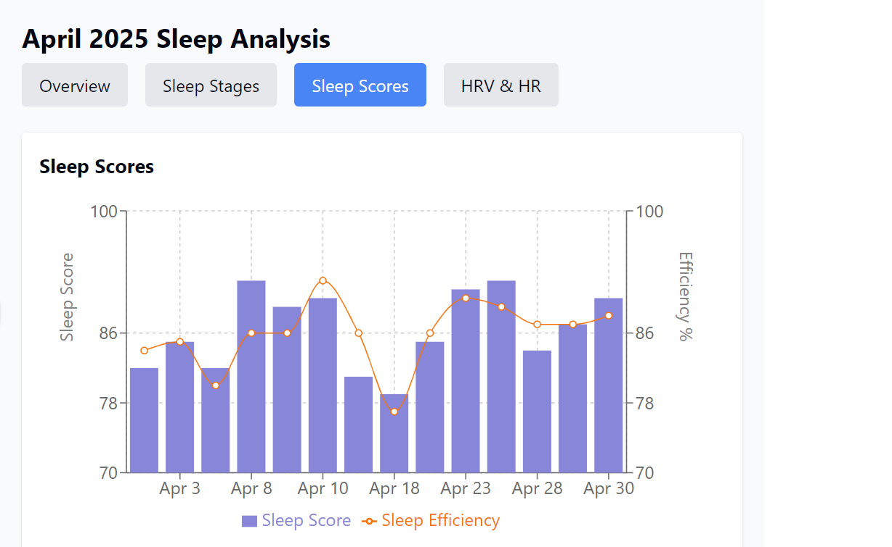
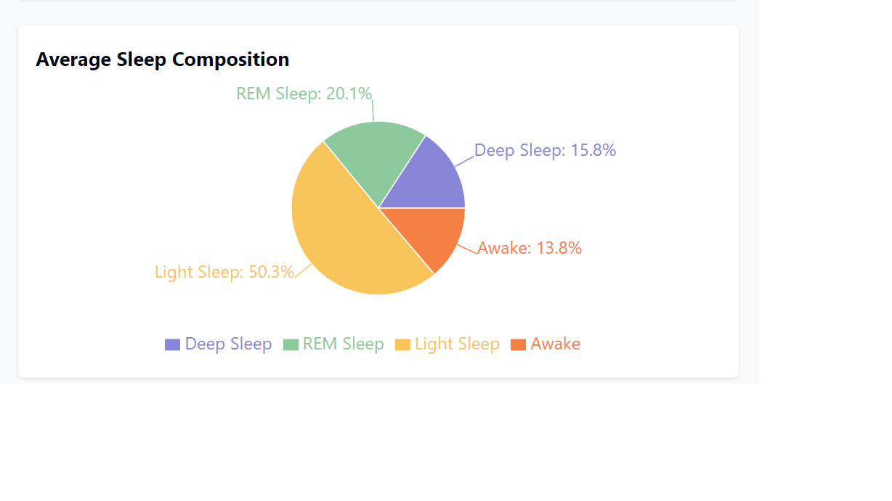
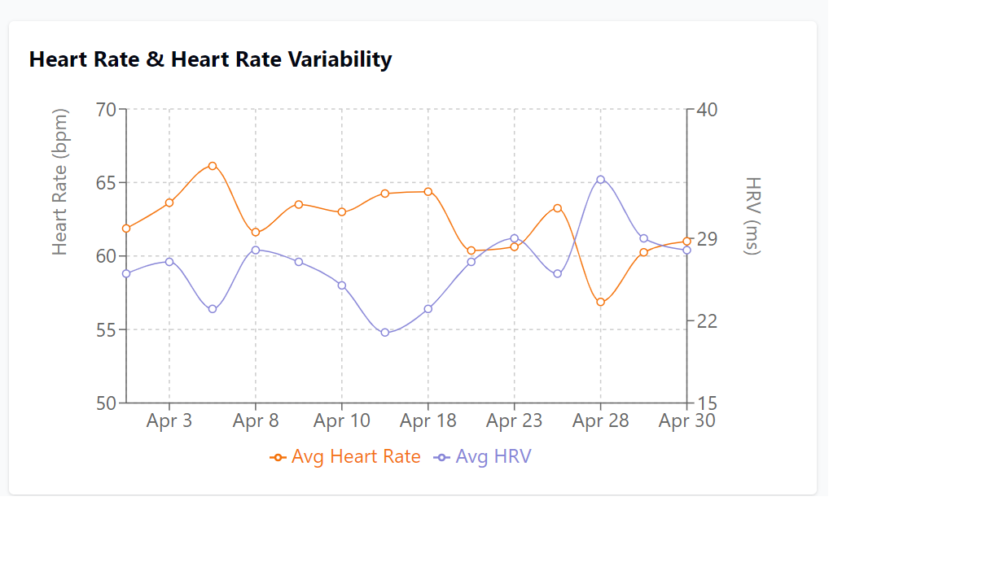

# Oura Ring Model Controller Protocol (MCP) Server

This server enables AI assistants to access and analyze your Oura Ring data through the Model Controller Protocol (MCP). It provides a structured way to fetch and understand your health metrics.

## Features

- Secure access to your Oura Ring data
- Pre-defined prompts for common health analysis tasks
- Customizable queries for specific health insights
- Support for analyzing correlations between different metrics
- Proper handling of time units and calculation guidelines
- Visualization capabilities for health metrics

## Getting Started

### Prerequisites

- Node.js v18 or higher
- An Oura Ring account with Personal Access Token

### Installation

1. Clone the repository:
   ```bash
   git clone https://github.com/yourusername/oura-mcp-server.git
   cd oura-mcp-server
   ```

2. Install dependencies:
   ```bash
   npm install
   ```

3. Create a `.env` file in the root directory with your Oura API token:
   ```
   OURA_TOKEN=your_personal_access_token_here
   ```

4. Build the project:
   ```bash
   npm run build
   ```

5. Start the server:
   ```bash
   npm start
   ```

### Getting an Oura Personal Access Token

1. Go to the [Oura Developer website](https://cloud.ouraring.com/personal-access-tokens)
2. Log in with your Oura account
3. Create a new Personal Access Token
4. Copy the token to your `.env` file

### Example Prompts

You can ask Claude things like:

- "Show me my sleep data for the last week and explain what it means"
- "Analyze how my meals affect my readiness scores"
- "Compare my stress levels on workdays versus weekends"
- "Show me my heart rate during sleep for nights when I had alcohol"
- "Visualize my sleep efficiency trends for the past month" (Claude will generate charts!)
- "Create a visualization comparing my readiness scores after different meals"

## Data Visualization

Claude can create visual charts to help you understand your health data. Simply ask Claude to "visualize" or "create a chart" of specific metrics. For example:

- "Visualize my sleep stages over the past week"
- "Create a chart showing the correlation between HRV and sleep quality"
- "Make a bar graph comparing my activity scores by day of week"
- "Plot my resting heart rate against stress levels"










## Data Handling Guidelines

This server follows these key guidelines:

- All duration fields are in seconds and converted to hours/minutes for display
- Sleep percentages are calculated using total_sleep_duration as denominator
- Sleep efficiency is calculated as (total_sleep_duration / time_in_bed * 100)
- Custom tags contain meal information in the comment field

## Contributing

Contributions are welcome! Please feel free to submit a Pull Request.
